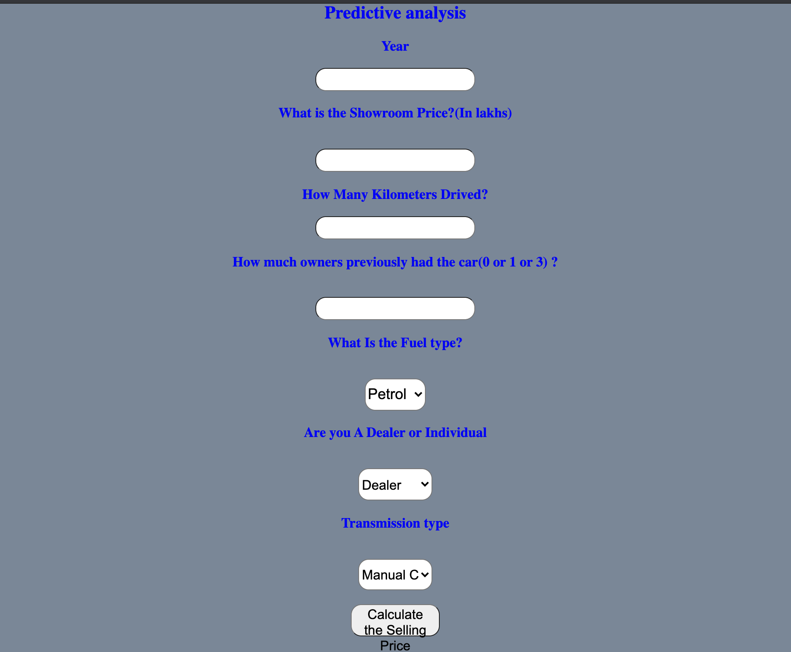
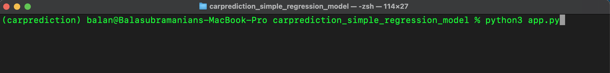
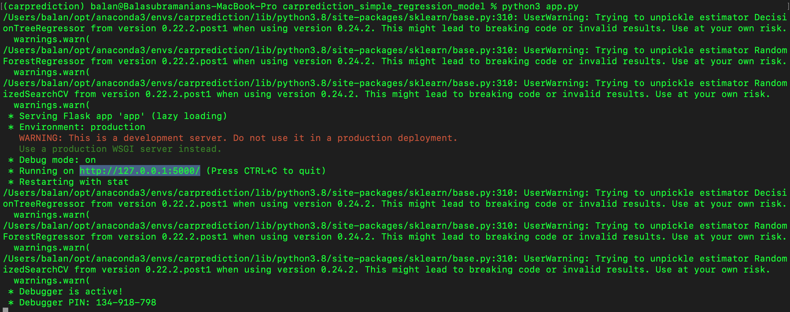
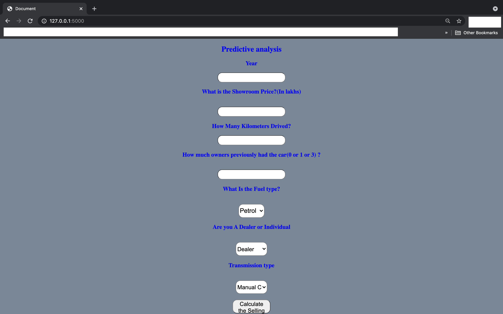

# Car Price Prediction
## Description
I have trained a ML model to predict the resale value of cars based on attributes such as the fuel type, # of previous owners, transmission type, current market price for new car of same model and age of the car. 
## Implementation Details
1. The dataset was taken from Kaggle  [Link]: https://www.kaggle.com/nehalbirla/vehicle-dataset-from-cardekho  
2. I used Google Collab to build my model with sklearn features. The best fitting model parameters were exported as a .pickle file to be used to predict prices while deployed.< 
3. I deployed the model using flask and jsonify libraries and a simple front-end interface (fig. below) using HTML to get input data to predict the car-price. 

## Instructions to Use Model
1. Download the code files onto your system. 
2. Install the required libraries which are mentioned in the requirement.txt document to run the application using pip or other package installer. 
3. Go to the folder where the files are stored on your terminal and run app.py. 

4. Copy the address where the application is hosted and run it on the browser of your choice.

